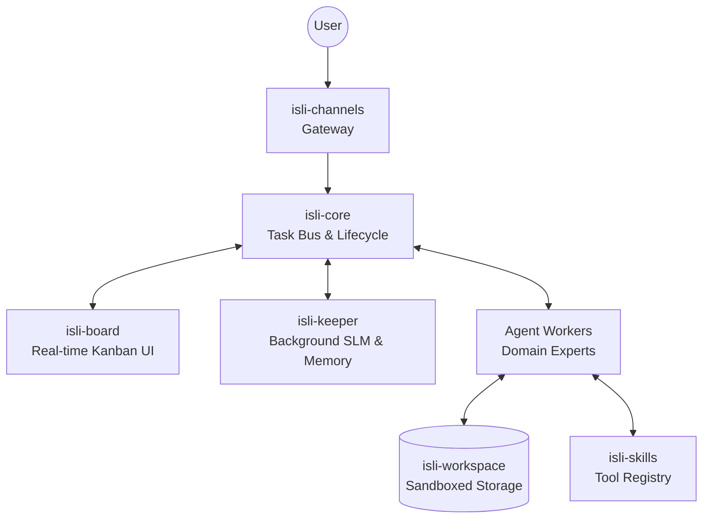

# ISLI — Intelligent System for Local Intelligence


**ISLI (Intelligent System for Local Intelligence)** is a modular, production-grade multi-agent system. It provides a specialized environment where domain-specific agents autonomously execute tasks while a central "Keeper" intelligence orchestrates context, routing, and memory.

## Architecture

ISLI inverts the traditional "central orchestrator" pattern. Instead of a single massive LLM bottlenecking all decisions, ISLI uses a lightweight local sidecar model (the **Keeper**) for background intelligence, while specialized agents handle domain-specific execution via their own models. All coordination happens explicitly on a real-time Kanban board.



## Why ISLI is Different

Most agentic systems rely on complex internal monologues and hidden API calls that leave you guessing what the AI is actually doing. ISLI is built differently:

- **The Shared Blackboard Protocol:** Agents **cannot** communicate directly in secret. All delegation, coordination, and sub-task creation happens explicitly via task cards on a real-time Kanban board. You see everything they do, as they do it.
- **Background Intelligence (The Keeper):** A persistent local Small Language Model (qwen3:1.7b) runs as a sidecar, silently pre-computing context, summarizing memory, and identifying PII *before* any cloud LLM is invoked. This makes your agents faster, cheaper, and more secure.
- **PII Mesh (De-identification):** Sensitive data is scrubbed locally by the Keeper and replaced with deterministic tokens. Cloud LLMs never see the raw PII, and the agent runner seamlessly rehydrates it locally before delivering the response.
- **Production-Ready Resilience:** Built with robust patterns including Bulkheads, Circuit Breakers, Checkpoint Recovery, and an event-driven task lease system. It doesn't just run scripts; it safely orchestrates long-running agentic workloads.

## Project Structure

| Component | Port | Description |
|-----------|------|-------------|
| `isli-core` | 8000 | FastAPI backend — task bus, WebSocket fan-out, agent process manager |
| `isli-board` | 5173 | React + Vite UI — Kanban board, settings, observability hub |
| `isli-keeper`| 8001 | Local Ollama sidecar for memory, PII mesh, and context injection |
| `isli-skills`| 8100 | Stateless HTTP microservices providing tools to agents |
| `isli-channels`| 8200 | Adapters for external interaction (Telegram, Web, Email, WhatsApp) |

## Quick Start (Recommended)

The fastest way to install ISLI on a Linux host or VPS is using the one-tap installer:

```bash
curl -sSL https://raw.githubusercontent.com/medelmouhajir/ISLI/main/scripts/install.sh | bash
```

This clones the repo, installs the CLI, and runs a pre-flight check (RAM, ports, Ollama detection) before walking you through an interactive configuration.

### Manual Docker Installation

```bash
git clone https://github.com/medelmouhajir/ISLI.git
cd ISLI
cp .env.example .env
# Edit .env with your secrets
docker compose up -d --build
```

## Management CLI

The `isli` CLI provides unified operational control over the entire system:

```bash
./isli status    # Check health of all 14 services
./isli update    # Safely update with automatic pre-update backups
./isli backup    # Snapshot Postgres, ChromaDB, and workspace files
```

## Implementation Status

ISLI is feature-complete across 12 rigorous development phases, including:
- **Phase 3:** Channels & Delivery Guarantees
- **Phase 4:** 4-Tier Memory & Data Integrity
- **Phase 8:** Advanced Local Research (SearXNG)
- **Phase 9:** Browser Automation (Accessibility-tree snapshots & Playwright)
- **Phase 10:** Full Cron Scheduling with Transactional Cloning
- **Phase 12:** Agent Identity Enhancements & Avatar System

**Recent Post-Roadmap additions:**
- **Council Chat (Multi-Agent Rooms)** — address multiple agents in one thread with side-by-side responses and shared context.
- **Files Generation (PDF, DOCX, XLSX)** — agents can now generate professional reports, spreadsheets, and documents natively and save them to their workspace.
- **Dynamic Local Model Management** — add arbitrary Ollama models (`gemma3:1b`, `phi4-mini`, etc.) to the Keeper catalog directly from the Board UI without code changes
- **Unified Notification System** — in-app inbox + Telegram alerts with quiet hours, digest batching, and agent-facing SDK tools
- **Context Safety** — hard output caps on file-read, db-query, and git-log; and **Secure Server-Side Secret Injection** to prevent credential leakage into logs or RAG memory.

## Documentation

Dive deep into the architecture, memory tiers, and security models in the `Docs/` directory:
- [01 — Architecture](./Docs/01-architecture.md)
- [02 — The Keeper](./Docs/02-keeper.md)
- [03 — Memory System](./Docs/03-memory.md)
- [04 — Agent SDK](./Docs/04-agents.md)
